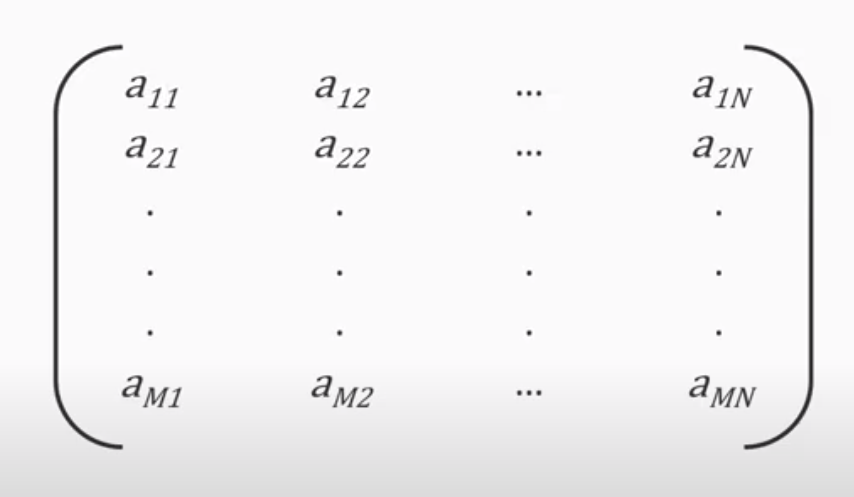
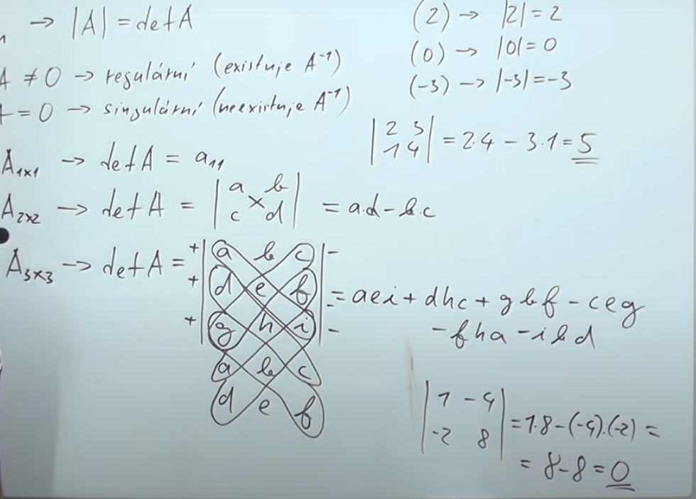
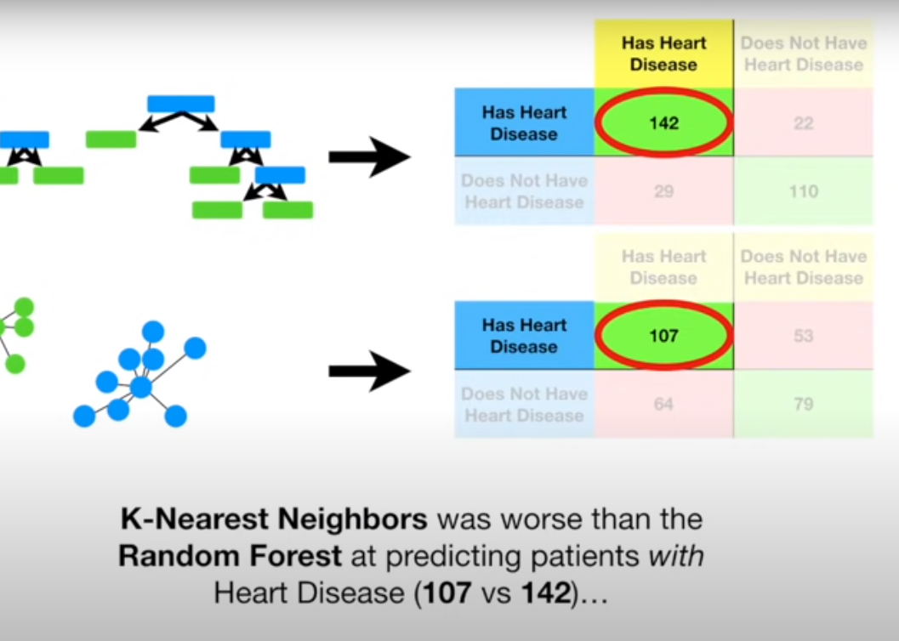
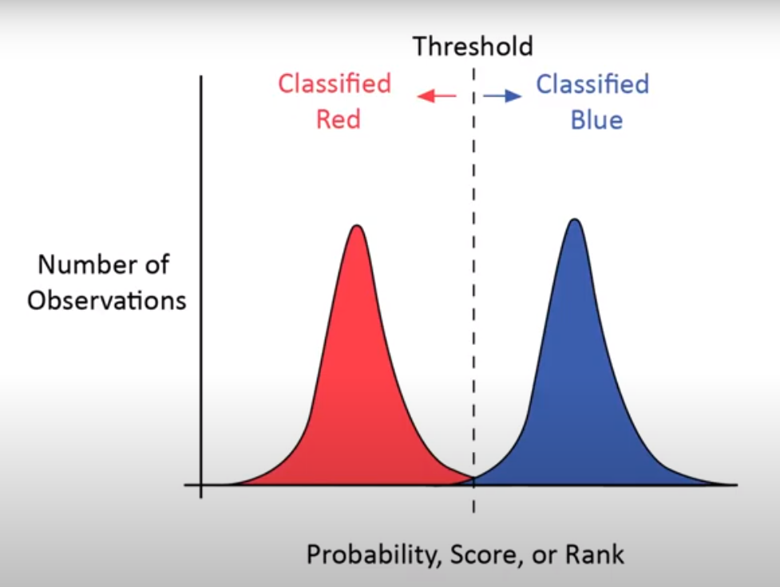
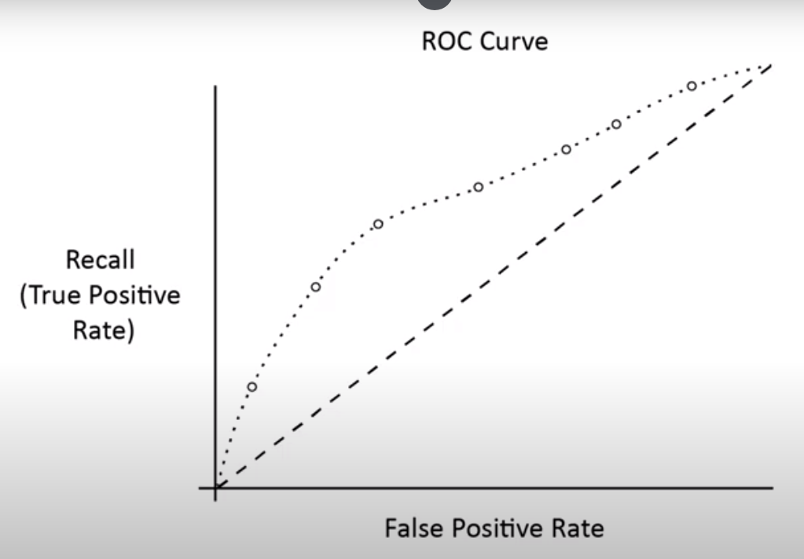
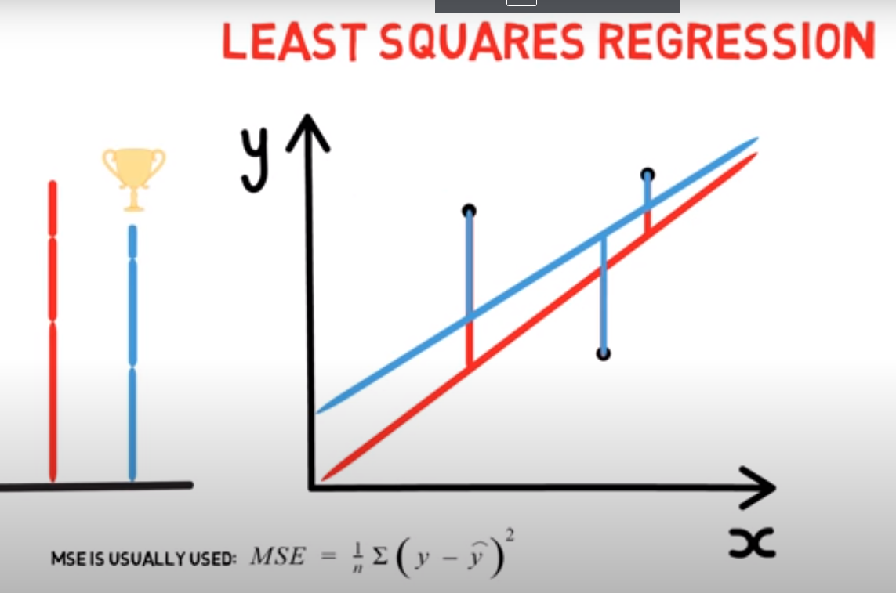
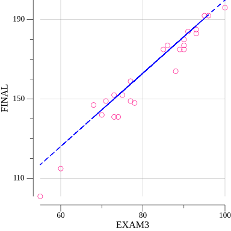

# go-learn

### Simple example of machine learning in go using [go-learn package](https://github.com/sjwhitworth/golearn)

 

## Understanding matrix

### Vector

- ordered collection of numbers arranged in row or column
- Each number in vector is called component
- In go vectors are represented as slice-like defined type
- [Go num package](https://www.gonum.org/) provides easy way to use numerical types

### Matrices

- Rectangular organizations of numbers
- Linear algebra dictates the rules of manipulation with matrices
- Location in matrix is defined by `A``row col` for rows and columns

 

 

### Determinant

 

 

## Evaluating models

- We can evaluate performace of our models by measuring how far off we were from predicted value

### Result types

- Continuos => result is probability, data for computation consists of numbers (stock price, temp, total sales)
- Categorical => Result is class that got most probability from dataset (Fraud / not fraud, name)

### Error values

#### MSE (Mean Squared Error)

- Takes the squares of the errors of correct value
- Tells us how different is in average prediction from predicted value

#### MAE (Mean Absolute Error)

- Maintains same units
- It is the difference between predicted value and actual value

#### MSD (Mean Squared Deviation)

### Evaluation metrics

- First you need to determine metric that fits the problem the best

#### Possible evaluation scenarios:

- True Positive
  - Predicted and observed category are same
  - Example: predicted fraud and observation was fraud
- False Positive
  - Predicted and observed category are not same
  - Example: predicted fraud but observation was not fraud
- True Negative
  - Predicted certain category, observation was not that category
  - Example: predicted not fraud and observation was not fraud
- False Negative
  - Predicted certain category, observation was the different category
  - Example predicted not fraud but observation was frau

#### Common metrics for measuring:

- Accuracy - Percentage of predictions that were right
- Precision - Percentage of positive predictions
- Recall - Percentage of identified positive predictions

### Individual numerical metrics

- Provide complete representation of model performance

#### Confusion matrices

- Use confusion matrices to determine the best algorithm
- Cols = Actual values
- Rows = Predicted values  
  +-----------------+-----------------+  
  |&nbsp;&nbsp; True positives &nbsp;&nbsp; |&nbsp;&nbsp;False positives &nbsp;&nbsp;|  
  |&nbsp;&nbsp; False negatives |&nbsp;&nbsp;True Negatives &nbsp;|  
  +-----------------+-----------------+  

 

#### ROC (Receiver operating characteristic)

- Tells us overall picture of performance of binary classifiers
- Plot the recall versus false positive rate
- Thresholds represent various boundaries or rankings

 

 

- The model evaluated by the ROC curve makes a prediction for two classes based on probability, ranking or score.

 

 

- A good ROC curve:
  - is in the upper left section of the plot, that means that model has better then random predictive power.
  - has more AUC (Area under curve) => if AUC is less then 50% predictions are to be considered random

 

## Linear Regression

- Simple machine learning models mostly used to predict a continuous variable
- it's formula is `y = mx + b` where `m` is the slope of the line and `b` is the intercept

### OLS (Ordinary least squares)

- Use to determine `m` and `b`
- Pick a value for `m` and `b`
- Measure vertical distance
- Distances - erros or residuals
- We use arithmetic mean for determining the shortest line by summing up errors

 

 

#### Pitfalls

- Be carefull while determining if regression line is suitable for values outside range
- Don't get caught in some relation of two variables while in reality they can be totally independent

#### Profiling data

1. Understand
2. Distribution
3. Range
4. Variability

#### Histogram

- You can visualize data with histogram
- Using [boston_house_prices.csv](https://github.com/TurniXXD/go-learn/src/datasets/boston_house_prices.csv) as an example data for histogram
  - [Example 1](https://github.com/TurniXXD/go-learn/src/DISTRICT_hist.png)
  - [Example 2](https://github.com/TurniXXD/go-learn/src/VALUE_hist.png)
- Use histogram for determining if we are working with the assumptions of linear regression => Test if all variables are normally distributed
- Use (q-q) plot (quntile-quantile) to determine how close are the distributions to normal distributions

#### Scatter plot

- To determine which variable to use as an independent variable make scatter plot vs each other variable
- Use scatter plots to determine most corollated variable to dependent variable and set is as an independent variable

#### Generating Linear Regression plot
- go to `./src` and run `go run main.go`
- after that plots will be generated find variable that is most corrolated to dependent variable and enter it
- with this selected value new plot will be generated where you can see regression line with scattered plot

 

 

#### Splitting dataset

- After all the variables are set we split the dataset into training and testing set
## Logistic Regression

## Understanding clustering

## Time series data

## Neural net

## Dockerizing model

## Sources

- [Confusion matrix](https://www.youtube.com/watch?v=Kdsp6soqA7o)
- [Machine learning with go](https://www.youtube.com/playlist?list=PLTgRMOcmRb3MgR1S-5DdMJyT6NzR_-7wE)
- [Simple Linear Regression for Machine Learning](https://www.youtube.com/watch?v=HoqXask9cN8)
